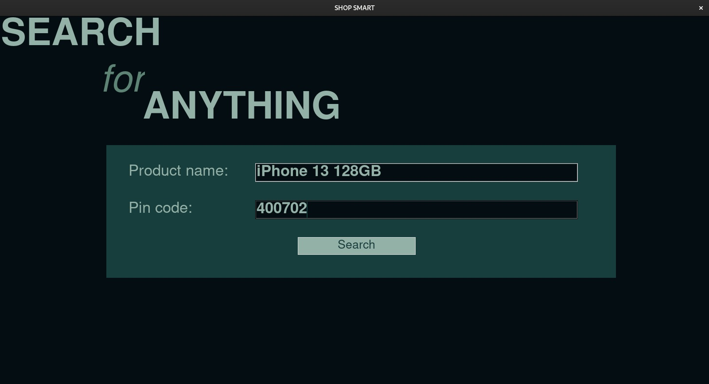
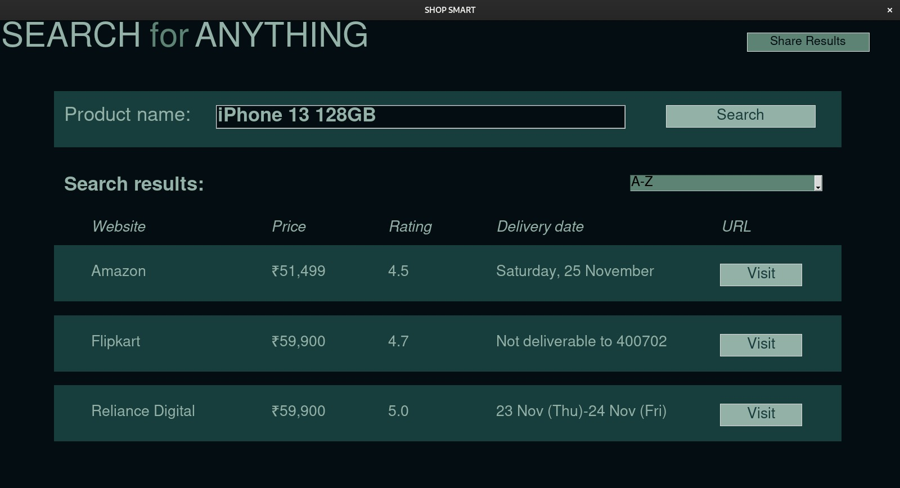

# ShopSmart

ShopSmart is a Python-based application that helps users compare prices and ratings of products across major e-commerce platforms, namely Flipkart, Amazon and Reliance Digital. By providing key insights from all these platforms, ShopSmart enables users to make informed decisions and choose the best deal while shopping online.

## Features

- **Product Search**: Search for products and retrieve the best match from Flipkart, Amazon and Reliance Digital.
- **Price Comparison**: Compare product prices from all the platforms side by side.
- **User Ratings & Reviews**: Get ratings and reviews for each product from all the websites to make an informed choice.

## How It Works

1. **Search for a Product**: Users can input a product name and their PIN code into the application.
2. **Web Scraping**: The application uses the `lxml` and `requests` libraries to scrape data from Flipkart, Amazon and Reliance Digital.

## Installation

1. Clone the repository:
    ```bash
    git clone https://github.com/chaitanya-p23/ShopSmart.git
    cd ShopSmart
    ```

2. Install required dependencies:
    ```bash
    pip install -r requirements.txt
    ```

3. Run the application:
    ```bash
    python main.py
    ```

## Usage

1. Run the app using `python main.py`.
2. Enter the product name and PIN code in the specified field.
3. View product results from Flipkart, Amazon and Reliance Digital.
4. Compare the prices, ratings, and other details.
5. Visit the product website link by clicking on the button present next to the search result.
6. Make your purchase.

## Screenshots




## Contributing

Feel free to fork this repository and contribute! You can submit pull requests with improvements, bug fixes, or additional features.
